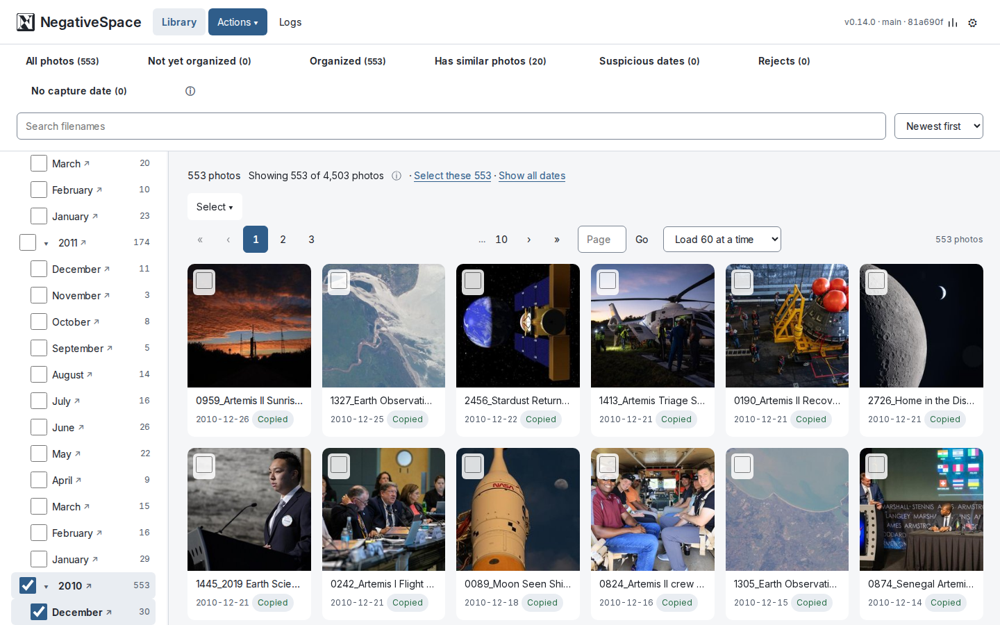
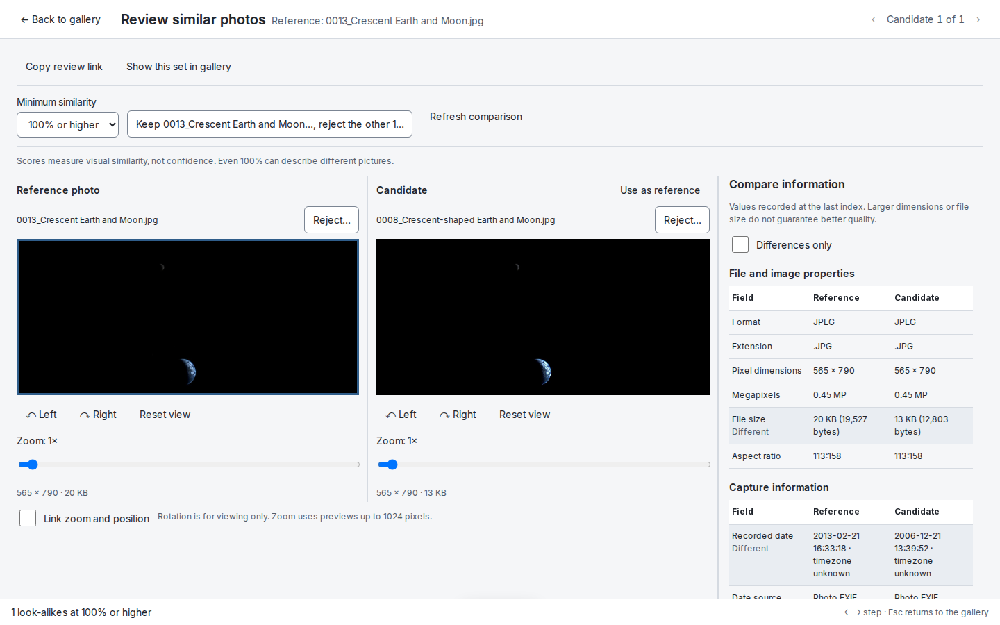
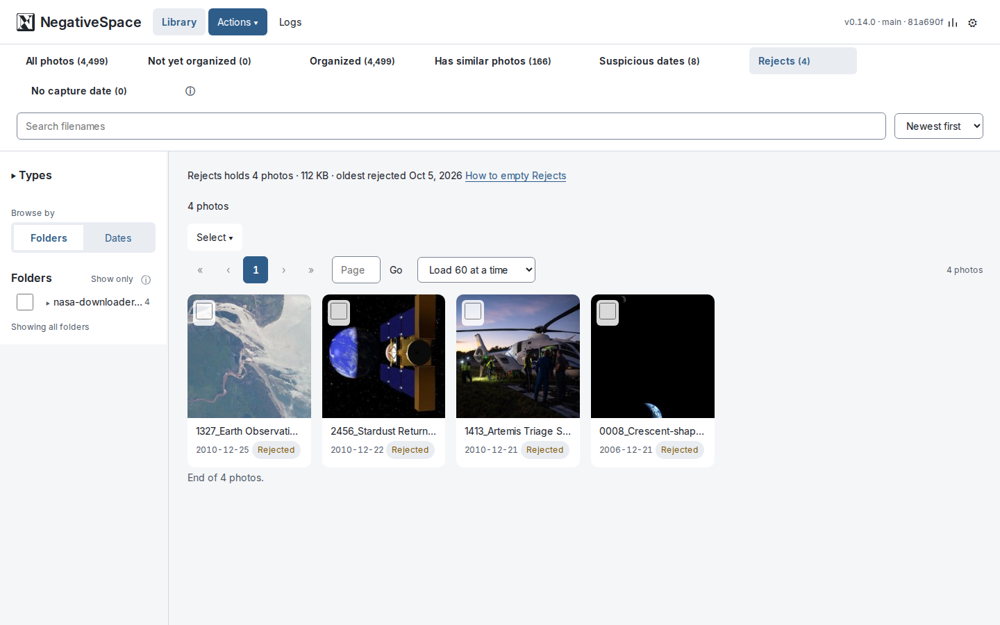

# NegativeSpace

NegativeSpace puts a large, messy photo collection in order. It reads every photo's date
from its EXIF metadata and files it under `YYYY/MM/DD`, finds exact duplicates and
look-alikes, and lets you turn down the photos you do not want. You use it through a web
interface in your browser; the engine behind it does the file work and records
everything it does.

**Your photos come first.** Nothing is deleted on trust: every copy is verified against
its original's checksum before anything happens to the original, and Move only removes a
source after its copy has been verified, live, at the destination. Index and Copy never
write to your source at all, so you can run them against a **read-only** mount of your
library and only ever let Move write to it. Photos you reject are moved aside, never
deleted. Interrupted jobs are reconciled on the next start, the catalog is backed up
after every job that changes it, and every photo's history is kept back to the file it
was first indexed from.

> **NegativeSpace is not a backup of your photos.** It protects files while it moves
> them, but the backups it makes are of its catalog, never of your photos. Keeping your
> own backups of your photos is your responsibility. See
> [If something goes wrong](docs/recovery.md).

## Contents

- [Features](#features)
- [Requirements](#requirements)
- [Quick start](#quick-start)
- [Configuration](#configuration)
- [Security](#security)
- [Usage](#usage)
- [Documentation](#documentation)
- [Notes and details](#notes-and-details)
- [License](#license)



## Features

- **Organize by date:** `YYYY/MM/DD` from EXIF; photos without a usable date go to
  `Undated/<year>` rather than being given a guessed one.
- **Duplicates:** exact copies found by content, filed once, with every copy recorded.
- **Find similar:** visual look-alikes, browsed by percentage and compared side by side.
- **Reject, without deleting:** turned-down photos move to a Rejects folder you empty
  yourself, and can be returned until then.
- **Copy or Move:** select any number of photos, a folder, or everything; reviewed before
  anything runs.
- **History and lineage:** every file a photo has been, and every job that touched it.
- **Logs, retry and stats:** failures with their reasons and a way to fix them; figures
  for the whole library.
- **Catalog backups:** automatic, verified and compressed copies of the catalog: its
  record of your photos and their history, **not the photos themselves**.

## Requirements

- Docker with the Compose plugin (`docker compose`), on Linux. Everything else (ExifTool,
  the image libraries) is inside the images.
- Four folders on the host: your photos, an empty destination, and two for the app's own
  data and its backups (see [Configuration](#configuration)).
- A desktop browser.

## Quick start

```bash
git clone https://github.com/MatthewJSalerno/NegativeSpace.git
cd NegativeSpace/docker
cp .env.example .env          # set your four folders, and PUID/PGID to `id -u` / `id -g`
docker compose up -d --build
```

Open **http://localhost:8080** (or the host's address). The first visit creates the
catalog and walks you through the settings. `docker compose down` stops it.

## Configuration

All of it lives in `docker/.env` (copied from `docker/.env.example`; git-ignored, so your
paths never reach the repository), read by `docker/compose.yml`.

| `.env` variable | Container path | Holds | Access |
| --- | --- | --- | --- |
| `SOURCE_DIR` | `/data/source` | Your photos, as they are | Read-only (the default); writable only if you Move |
| `DEST_DIR` | `/data/dest` | The organized library (`library/`) and Rejects (`rejects/`) | Read-write |
| `APPDATA_DIR` | `/appdata` | The catalog, its history and the logs: irreplaceable | Read-write |
| `BACKUP_DIR` | `/backups` | Catalog backups (not photos), on separate storage from `/appdata` | Read-write |
| *(named volume)* | `/cache` | Thumbnails, rebuilt from the photos if lost | Read-write |

| Setting | Default | Purpose |
| --- | --- | --- |
| `PUID` / `PGID` | `1000` | Run as your user, so the files written belong to you (`id -u`, `id -g`) |
| `TZ` | `UTC` | Time zone for photos without an EXIF date, filed by their file time |
| Port `8080` | | The web interface |

> **Never mount source and destination to the same underlying folder, or place either folder inside the other.** Different container paths (`/data/source` and `/data/dest`) do not make the storage separate. Check the host folders or network-share mappings, including NFS. Overlapping locations can cause unintended processing or deletion of your photos. This configuration is unsupported. The engine refuses to start when it can see the overlap (the same folder, one inside the other, or one folder mounted at both paths) and never deletes a source that turns out to be the same file as its copy — but it cannot see every alias, such as two separate network mounts of one share.

Source and destination must be separate folders, neither inside the other; so must the
app data and backup folders. **Point a gallery application such as Immich at
`DEST_DIR/library`**, not `DEST_DIR`.

If you write your own compose file instead, the essentials are:

```yaml
services:
  web:
    build:
      context: ..
      dockerfile: docker/web.Dockerfile
    ports:
      - "8080:8080"
    depends_on:
      - app

  app:                            # the web container sends /api to "app"
    build:
      context: ..                 # the images build from the repository root
      dockerfile: docker/app.Dockerfile
    environment:
      PUID: 1000
      PGID: 1000
      TZ: America/New_York
    volumes:
      - /path/to/your/photos:/data/source:ro
      - /path/to/organized:/data/dest
      - /path/to/appdata:/appdata
      - /path/to/backups:/backups
      - cache:/cache
    stop_grace_period: 5m         # lets a cancelled job finish the file it is copying

volumes:
  cache:
```

Save it in `docker/`, beside the Dockerfiles. The shipped
[`docker/compose.yml`](docker/compose.yml) adds a check that every folder exists.

To show the exact build beside the version number at the top right of every page,
build with `NS_BRANCH=$(git branch --show-current) NS_COMMIT=$(git rev-parse --short HEAD) docker compose up -d --build`.

## Security

**NegativeSpace has no login yet.** Anyone who can open its page can use every button,
including **Move**, which deletes source photos once their copies are verified. So:

- Keep it on your own network, and never forward its port (8080) to the internet.
- For access from elsewhere, use a VPN (such as WireGuard or Tailscale) or a reverse
  proxy that asks for a password first (such as Authelia, Authentik, or nginx with
  basic authentication).
- Leave the source folder read-only unless you are about to Move.

A built-in password is planned before the first release.

## Usage

1. **Index** reads your photos into the catalog. It moves and copies nothing.
2. **Copy** (never touches the source) or **Move** (removes each source after its copy is
   verified) everything not yet organized, a folder, or the photos you select. Both show
   what they will do and ask first.
3. **Has similar photos** shows look-alikes; open a photo to compare its matches side by
   side, keep one and reject the rest. Percentages measure visual similarity: below 90%,
   matches are more likely to be unrelated.
4. **Reject** moves a photo you do not want to `rejects/`; the **Rejects** view shows what
   it holds and how to empty it, and **Return to library** brings a photo back.
5. **Logs** lists every job and failure with its reason and **Retry**; **Stats** gives
   figures for the whole library; each photo's **lineage** shows everything that happened
   to it.

A running job shows its progress at the top of the page and can be cancelled; closing the
browser does not stop it, and stopping the containers cancels it cleanly. **Move needs a
writable source:** with a read-only one it can only copy, and each photo shows **Copied
only** with the reason; set `read_only: false` on the source volume in
`docker/compose.yml` and Move them again.

<p>
  
  
</p>

The [user guide](docs/user-guide.md) walks through a first session, with screenshots.

## Documentation

Specifications are organized by component, not by release phase:

| Document | Covers |
| --- | --- |
| [project-spec.md](docs/project-spec.md) | Scope boundary, architecture, and what exists today — start here |
| [user-guide.md](docs/user-guide.md) | A first session, start to finish, with screenshots |
| [recovery.md](docs/recovery.md) | If something goes wrong: what can be recovered, and how to restore a catalog backup |
| [engine-cli.md](docs/engine-cli.md) | Running the engine as a command, for development and scripting |
| [engine-spec.md](docs/engine-spec.md) | `ns-engine.py`: hashing, metadata, placement, Copy-Verify-Delete, and the SQLite catalog it owns |
| [webui-spec.md](docs/webui-spec.md) | The browser-facing half: jobs, selection, settings, logs, inspection, curation |
| [api-spec.md](docs/api-spec.md) | The web API as implemented: every route, its parameters, responses and errors |
| [ui-design.md](docs/ui-design.md) | Shared styling and interaction contract for UI changes |
| [tests/README.md](tests/README.md) | Automated checks, sample instances and manual validation |
| [similarity-validation.md](docs/similarity-validation.md) | Validation record for visual similarity: measurements and checkpoints |
| [large-library-performance.md](docs/large-library-performance.md) | The measurement plan and results for libraries of 200,000+ photos |
| [CHANGELOG.md](CHANGELOG.md) | What changed in each version |
| [TODO.md](TODO.md) | Open work, open design questions and the durability claims ledger |

## Notes and details

- **User Mapping:** `PUID`/`PGID` match the container process permissions to your host user, preventing root-owned output files. On start, the container gives that user ownership of all of `/appdata`, but only the top of `/data/dest`. Folders and files already in the destination keep their owners, so use the same `PUID`/`PGID` every time. The container refuses to start if `/appdata` is not writable by that user, and warns if `/data/dest` is not.
- **Timezone (`TZ`):** Controls which `Undated/<year>/` folder a photo lands in when it has **no usable EXIF date** and the engine falls back to the file's modification time. A container does **not** inherit your workstation's timezone — it runs UTC unless told otherwise — so a file modified at 21:00 local time is read as the *next* day. Pass your zone to avoid that:

  ```bash
  -e TZ=America/New_York
  ```

  Photos that *do* carry an EXIF date are unaffected: those timestamps have no timezone attached and are used exactly as the camera recorded them, which is almost always what you want. The engine logs the zone it resolved at startup (`Timezone: EDT (UTC-0400)`), so you can confirm the setting took effect rather than assuming it did.

  Because an undated photo is filed under `Undated/<year>/` (see below), the timezone changes its **folder** only when the mtime falls within a few hours of New Year. It still decides the day recorded as that photo's date in the catalog, which is what the 21:00 example above describes — so the setting is worth getting right either way.
- **Undated photos:** A photo the engine cannot date does **not** enter the date tree. It goes to `Undated/<year>/`, where the year comes from the file's modification time.

  This is deliberate. The modification time is a real fact about the *file* but not about the *photograph* — for an export it is the download date, which is how photos from the 2000s can end up looking like 2024 photographs. Filing them beside photos whose dates came from a camera makes a guess indistinguishable from a fact. Roughly **8%** of a real library has no usable EXIF date, so this is not a rare corner.

  `Undated/` is also where you go to fix them: the folder *is* the review list, and the catalog records each photo's original path and filename, which is frequently where the real date turns out to be.
- **Volume Layout:**
  - `/data/source`: Raw input directory containing photos.
  - `/data/dest`: Structured target directory. Organized photos live in `library/`, by `YYYY/MM/DD`, with photos the engine could not date filed under `library/Undated/<year>/` instead. **Point a gallery application such as Immich at `dest/library`, not `dest`**: folders beside it, such as photos you turn down, are not meant for the gallery.
  - `/appdata`: Dedicated application directory storing persistent data inside `/appdata/db` and log files inside `/appdata/logs`.
  - `/cache` *(optional)*: Thumbnail cache. **The scan phase writes here** unless `--no-thumbnails` is passed. Every mode begins with a scan, so a `--move` or `--copy` run generates thumbnails too; what never touches the cache is the transfer phase itself — copying, verifying and deleting ignore it entirely. It is kept separate from `/appdata` on purpose: everything in `/appdata` is irreplaceable and should be backed up, whereas every file here is reproducible from the photo it was generated from. Deleting it costs only the time to regenerate, and it should be **excluded** from backups rather than included. The engine removes a thumbnail itself once no catalogued photo holds its content any more, as after a photo is edited outside the app and re-indexed. Mount it to keep thumbnails when the container is replaced; leave it unmounted and they live in the container's writable layer instead.

    Thumbnails live under `/cache/thumbnails/`, keyed by the photo's **content hash** rather than its catalog id or path, and fanned out by the hash's first two characters: `/cache/thumbnails/ab/abcdef….jpg`. The `thumbnails/` segment exists so a future cache of some other kind has an obvious place to go rather than being mixed in beside these. Byte-identical duplicates share a single thumbnail instead of generating one apiece, and the cache survives a catalog rebuild, since content hashes are stable where row ids are not.
  - `/backups`: Catalog backups. After every Index, Copy or Move that recorded changes, the engine writes one verified, self-contained snapshot of the catalog here, compressed with [Zstandard](https://facebook.github.io/zstd/) (`ns-catalog-<UTC time>-<attempt>-<trigger>.db.zst`, no `-wal`/`-shm` companions). A full-library catalog of about 520 MB compresses to about 20 MB. `--backup-now` writes a manual one; it takes the engine lock, so it is refused while a job runs. **This must be a mounted volume.** Left unmounted, `/backups` is just a folder inside the container, and a backup there would disappear with it, so the engine records the backup as failed instead of writing it. A failed backup is logged beside the job's result and never changes it.

    The latest 20 automatic backups are kept (the `backup_retention` setting). The oldest beyond that are removed only after a newer one succeeds. Manual backups are never removed by the engine. To restore one, follow [If something goes wrong](docs/recovery.md#restore-a-catalog-backup). A restored catalog does not undo anything done to photos, and no catalog backup contains a photo.

    **Kept separate from `/appdata` on purpose, and for the opposite reason to `/cache`.** A backup written inside the directory it is backing up dies with it, and losing `/appdata` is exactly the failure a backup exists to survive. Mount it on different storage from the catalog if you can.

    **Unlike `/cache`, these are not disposable.** `photos` can be rebuilt by re-running an Index, but `runs` and `operations` cannot — nothing recomputes what the engine *did*. After a `--move`, a `Removed_Duplicate` row is the only remaining evidence a file ever existed. So this directory holds the only copy of your library's history outside `/appdata`: include it in your own backups. The engine prunes only its own automatic backups beyond the retention limit; nothing else here should be treated as disposable.
- **Catalog versions:** a catalog from an older schema is **refused, not migrated**. The engine stamps a schema version and fails closed on one it does not recognise, rather than altering a database it may not understand. Preserve the old catalog and let a fresh one be created; everything in `photos` is derived from your source files and is rebuilt by an Index. `runs` and `operations` are not derived — see `/backups` below.
- **Persistence:** SQLite database (`ns_sqlite.db`) stores SHA1 checksums, perceptual hashes, and status to prevent re-processing across multiple runs. The storage engine is named in the file so a second store can sit beside it later without ambiguity.
- **Date & Metadata Resolution:** ExifTool is a **hard requirement** — the engine won't start without it (both the `exiftool` binary and the `PyExifTool` Python package). It runs as a persistent process per worker rather than spawning a subprocess per file, cutting ExifTool overhead roughly 30x. PIL and file-modification-time remain as defensive per-file fallbacks for the rare case ExifTool itself fails on one specific file — see `ns-engine.py`'s module docstring for the full breakdown.
- **Single-Instance Lock:** Only one engine process may run against a given `--base` (i.e., a given `/appdata` mount) at a time — enforced via an OS-level `flock` on `/appdata/engine.lock`.

  **`engine.lock` is always present, including when nothing is running — this is normal.** The file is not the lock; it is just something to hold a lock on. `flock` is a kernel-side lock keyed to an *open file descriptor*, so it disappears the moment the process's descriptors close and the leftover file means nothing on its own. That is the reason for choosing `flock` over a PID file or an "exists = busy" marker: those leave a stale marker after a hard kill and then need liveness probing and a manual override, each of which can either deadlock the tool or let two writers run at once. Here the kernel releases the lock on *every* exit path — clean exit, unhandled exception, `SIGKILL`, OOM-kill, power loss — so a force-stopped container never needs the file cleaned up by hand.

  The file's contents (`PID 1 — held since 2026-...`) are diagnostic only and describe whichever process held it last, not a current one. You can delete it safely while nothing is running, though there is no reason to; deleting it *during* a run is mildly unsafe, since a second process would create a new inode and lock that instead.

  **NFS caveat:** `flock` reliability is weaker over NFS depending on the server/client's `lockd`/`statd` setup — fine for local disk or a standard Docker volume backing `/appdata`, but worth a second look if that mount is ever NFS-backed instead. Note this applies to `/appdata` only: an NFS-mounted `/data/source` has no bearing on the lock.

  **A second, unrelated NFS caveat — this one for `/data/dest`.** A share exported `async` can acknowledge an `fsync` before the data has actually reached the server's disk, and the engine cannot see how a share is exported. So **a Move to a network share stops and asks first**: it copies and deletes nothing, recommends `--copy` (which never deletes a source, so nothing can be lost), and runs only when you add `--confirm-network-destination`. Confirm only for a share exported `sync`. Copy to a network share is never stopped, and local disk is unaffected.
- **One catalog per destination.** Because the lock is per `/appdata`, two containers using **different** `/appdata` mounts are not serialised against each other at all. Pointing them at one shared `/data/dest` is **unsupported**.

  Your photos are not at risk if you do it — a source is only ever deleted after the engine doing the deleting has verified, live, the copy it made itself. What you get instead is unexplained failures: crash recovery in one catalog can delete a partial file the other is still writing, both can pick the same free filename and one loses the race, and neither knows about the other's files, so the same photo can be delivered twice under different names. Each of those ends as a recorded failure or a redundant copy, never a lost original.

  Use one `/appdata` per destination. Several *sources* feeding one destination is fine — that's one catalog with several runs, which is exactly what it's built for.
- **Cancelling a run.** `docker stop <container>` sends the engine a cancel: it finishes the file it is copying, records every photo it did not reach as `Cancelled`, takes a catalog backup, and settles the run `Cancelled`. Docker waits only **10 seconds** before killing the container by default, and one large file over a network share can take longer than that. `docker/compose.yml` sets `stop_grace_period: 5m` to allow for it. A run killed before it settles is not lost: it is recorded `Interrupted` at the next start and its files are reconciled, but it gets no backup until you run `--backup-now` or the next job that records changes.
- **If a run appears stuck.** Cancellation is checked between files, and between batches during a scan, so a worker blocked indefinitely — an unresponsive network mount, a native decoder wedged on a malformed file — can stall a scan with no deadline. The symptom is progress lines stopping while the container stays alive.

  `docker stop` is the remedy, and it is safe: it escalates to `SIGKILL`, the kernel releases the lock immediately, and the next run marks the interrupted run `Interrupted` and settles any file left mid-operation. Nothing needs cleaning up by hand.

  The *unbounded wait* is specific to the scan, where the engine waits on worker processes with no deadline. A blocking filesystem call — a hung network mount, a disk that stops answering — can stall either phase, a copy or a delete included; being single-threaded governs how much runs at once, not whether a call ever returns. `docker stop` is the answer in both cases, and a stall during a Move leaves the source file where it is.
- **Supported Formats:** 36 extensions — 13 raster (`.jpg`, `.jpeg`, `.jpe`, `.jfif`, `.png`, `.gif`, `.bmp`, `.webp`, `.tif`, `.tiff`, `.heic`, `.heif`, `.avif`) and 23 RAW (`.raw`, `.dng`, `.cr2`, `.cr3`, `.crw`, `.nef`, `.nrw`, `.arw`, `.srf`, `.sr2`, `.raf`, `.orf`, `.rw2`, `.pef`, `.ptx`, `.srw`, `.erf`, `.3fr`, `.fff`, `.iiq`, `.mos`, `.mrw`, `.x3f`). RAW files are decoded via rawpy/LibRaw; the two sets are defined as `RASTER_EXTENSIONS` and `RAW_EXTENSIONS` in `ns_db.py`, with the supported set derived as their union. Narrow a run with `--exts` (dots optional: `--exts jpg,cr2` and `--exts .jpg,.cr2` are equivalent). You may list an extension the engine cannot read, such as `.mov`; the run warns that those files are still catalogued and still carried into the destination by Copy and Move.

  **The engine only ever operates on files it supports.** Anything else in `--source` — sidecars, videos, documents, previews, stray archives — is left exactly where it is, untouched and not catalogued; a full Index only counts it, by file type, in its discovery summary. A `--move` therefore does not empty the source directory, and is not meant to: it moves what it can, and reviewing what remains is yours to do. Expect leftovers, and expect them to be the files this tool was never asked to handle.

## License

NegativeSpace is free software: you can redistribute it and/or modify it under the terms
of the GNU General Public License as published by the Free Software Foundation, either
version 3 of the License, or (at your option) any later version. It is distributed in the
hope that it will be useful, but WITHOUT ANY WARRANTY; without even the implied warranty
of MERCHANTABILITY or FITNESS FOR A PARTICULAR PURPOSE. See [LICENSE](LICENSE) for the
full text.
