# User guide

A first session with NegativeSpace, start to finish. The screenshots use NASA's public
image library; yours will look the same with your own photos.

> **Before you start:** NegativeSpace is not a backup of your photos. It backs up its
> catalog, never the photos themselves; keeping your own backups of your photos is your
> responsibility. See [If something goes wrong](recovery.md).

Install it first: the [README's quick start](../README.md#quick-start) takes four commands.

## 1. First start

Open **http://localhost:8080**. There is no catalog yet, so the page offers to create one,
then walks through the settings in four short steps. They are starting values, and every
one can be changed later from the gear icon at the top right.

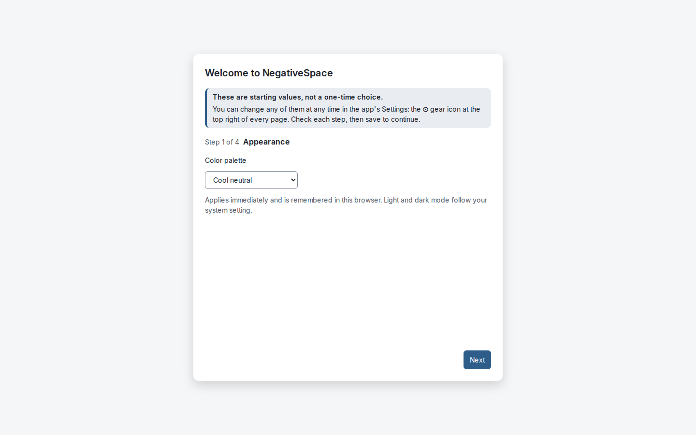

The **Files** step chooses which file types to look for, and when to be reminded to empty
Rejects. **Backups** explains what NegativeSpace backs up (its catalog, not your photos).
**Performance** sets how many photos are read at once.

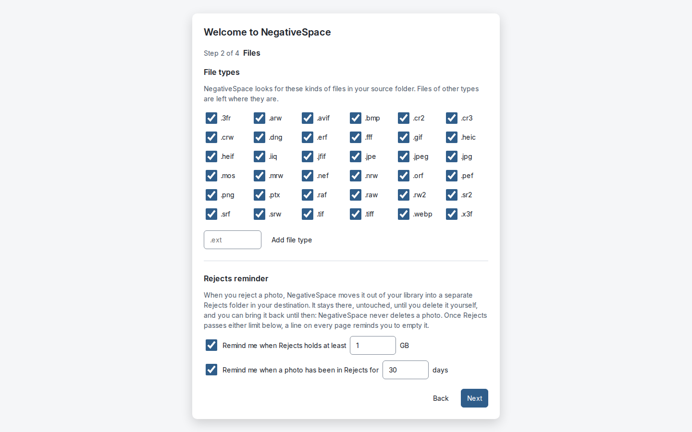

## 2. Index: read your photos

The library starts empty. **Jobs** holds the jobs for the whole library; each item says
what it does, and why when it cannot run yet.

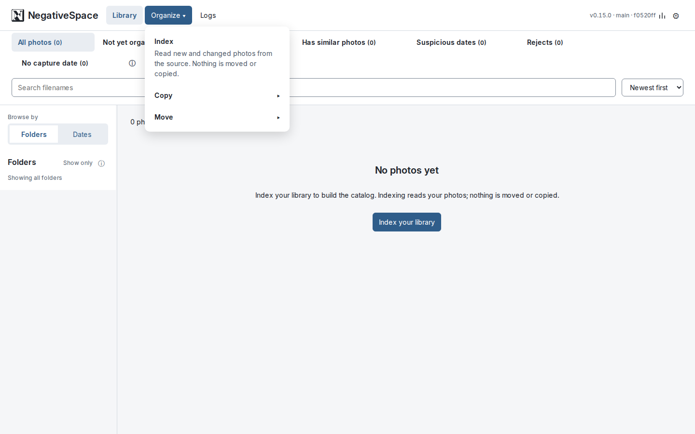

**Index** reads every photo in your source: its date, a checksum of its content, and a
small thumbnail. It moves and copies nothing, and never writes to your source. Its progress
shows at the top of the page; closing the browser does not stop it.

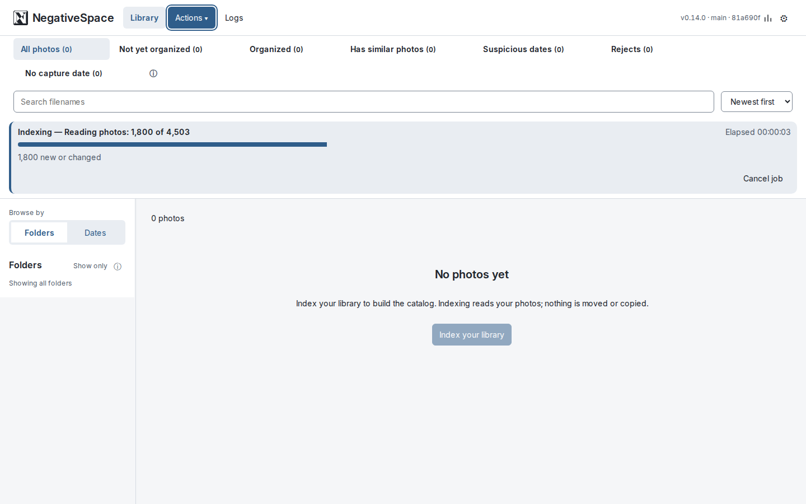

## 3. Look around

When the Index finishes, the gallery shows every photo. Browse by **Folders** or **Dates**
on the left, search by filename, and use the views along the top: everything, what is not
yet organized, look-alikes, suspicious dates, Rejects, and photos with no capture date.

Click a photo to open it in the panel on the right: its file, its dates and where they came
from, and its history.

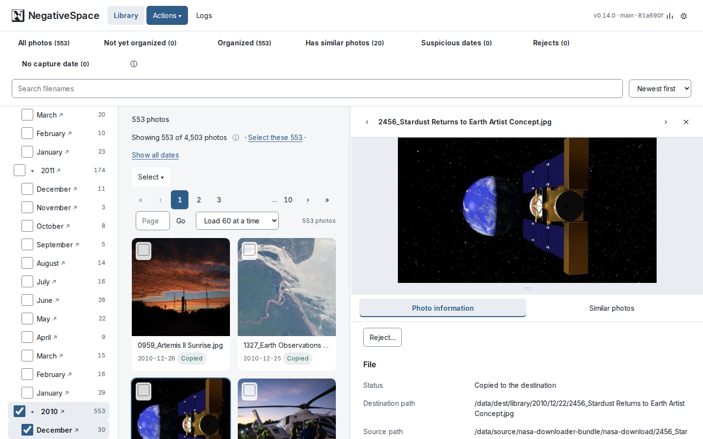

## 4. Copy or Move

**Jobs › Copy** files every photo not yet organized into the destination's `library/`
folder, under `YYYY/MM/DD`, and never touches your source. **Move** does the same, then
removes each original once its copy is verified (it needs a writable source). Either can
take everything or one folder from Jobs. Tick photos instead and the bar at the top
offers what applies to them: Copy, Move, Reject, or Return to library. Each asks first.
A selection holds library photos or photos in Rejects, never both, so each action means
one thing.

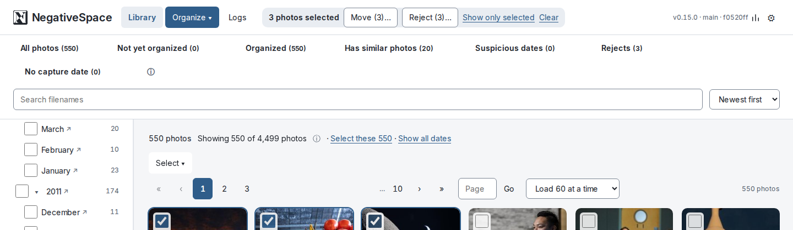

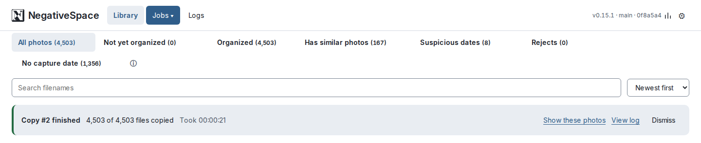

Which to use is your choice. If you would rather not give any app write access to your
originals, use Copy only: the source stays read-only, you check the library your own way,
and you delete the originals yourself once you are confident. NegativeSpace never needs
to delete anything for its library to be complete.

## 5. Similar photos

**Has similar photos** lists photos with look-alikes. Open one and choose **Similar
photos**: the counts show how many matches it has at each percentage. The percentage
measures visual similarity, not certainty; below 90%, matches are more likely to be
unrelated.

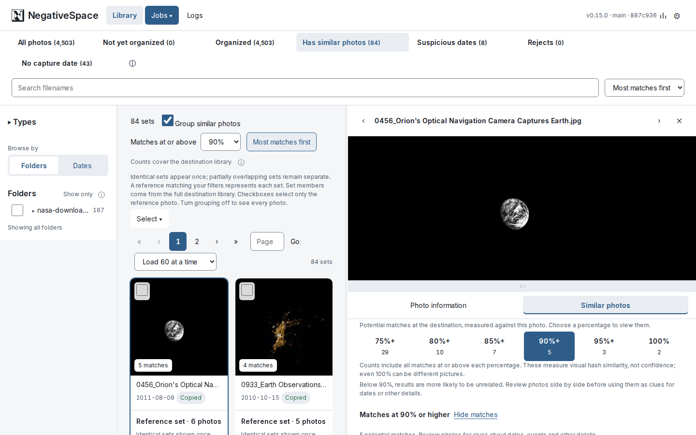

Open a match to compare the two side by side: their size, format, dates and every
recorded detail. **Reject…** under a photo turns that one down; **Keep this one, reject
the other…** keeps one and reviews the rest before anything moves.

## 6. Reject what you do not want

**Reject…** moves a photo out of your library into a separate `rejects/` folder in your
destination. Nothing is deleted: the **Rejects** view shows what it holds, **Return to
library** brings a photo back, and you empty the folder yourself (**How to empty
Rejects** says how). A reminder appears on every page once Rejects grows past a size or
age you set in Settings.

If you Move, a rejected photo's original in your source is deleted too, once its copy in
Rejects is verified, so the source can end up empty. That copy is then the only one:
empty Rejects and the photo is gone. Every Move that includes rejected photos says so first.

## 7. Check dates

**Suspicious dates** lists photos whose recorded year is before 1800 or in the future,
usually a camera clock that was never set. They are hints to look at; NegativeSpace
changes no date by itself.

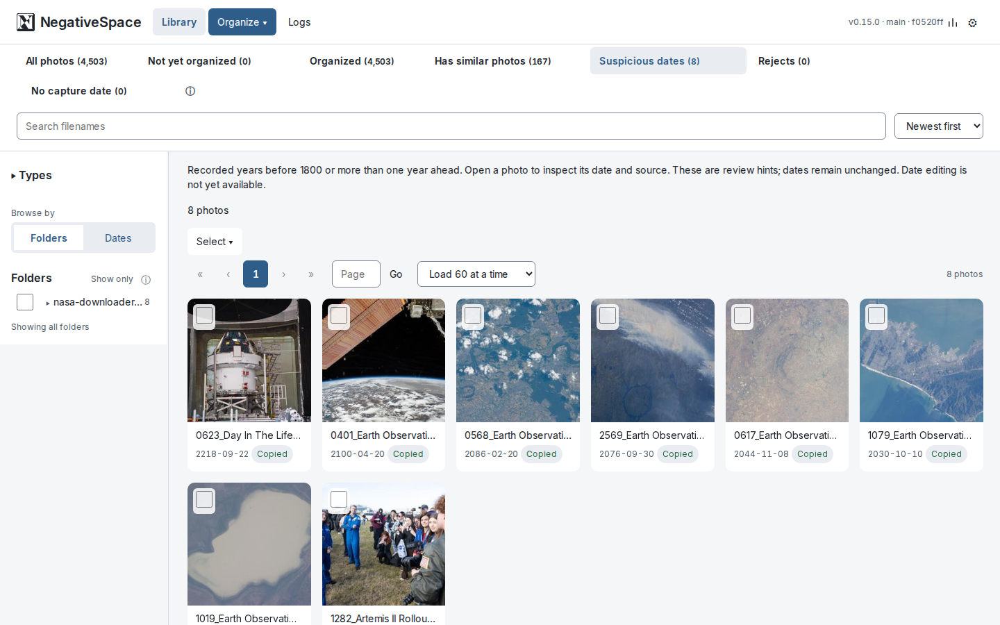

## 8. History, logs and stats

Every photo keeps its full history: each file it has been, each copy made of it, and
every job that touched it. **View lineage tree** in the panel shows it.

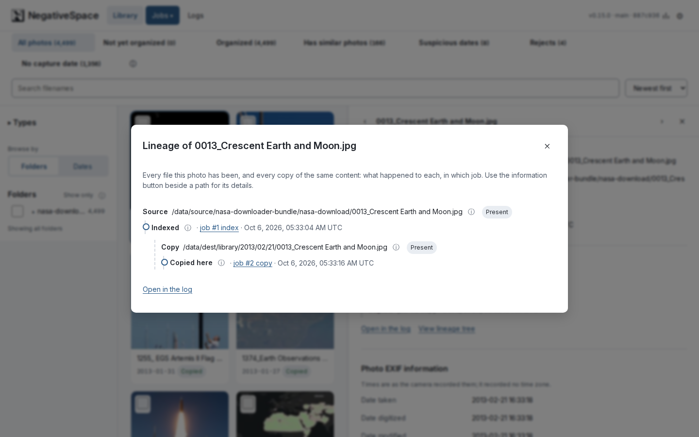

**Logs** lists every job and everything it did, with any failures, their reasons, and
**Retry**.

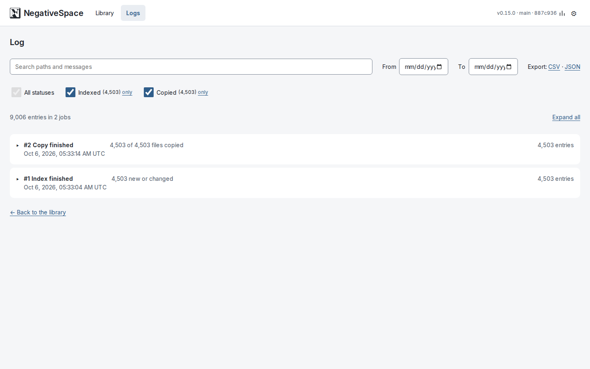

The **Stats** icon at the top right gives figures for the whole library.

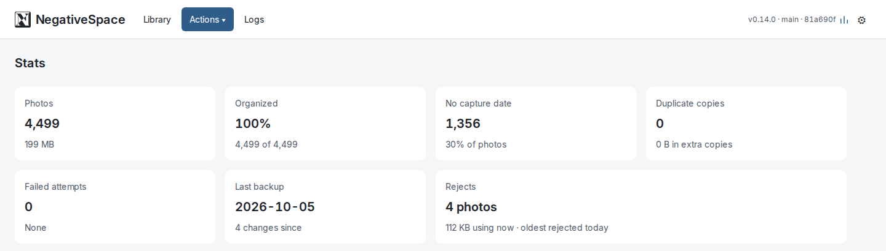

## 9. Settings

The gear icon opens Settings, in four tabs: **Appearance**, **Files**, **Backups** (with
the list of catalog backups and Back up now) and **Performance**.

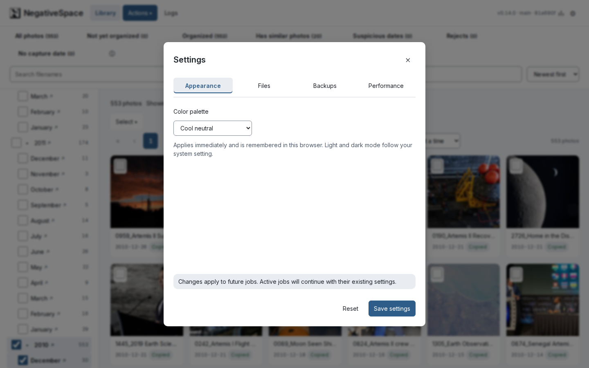

## Next

- Keep your own backups of your photos and of the destination.
- Point a gallery application such as Immich at the destination's `library/` folder, not
  the destination itself.
- [If something goes wrong](recovery.md) explains what can be recovered, and how.
